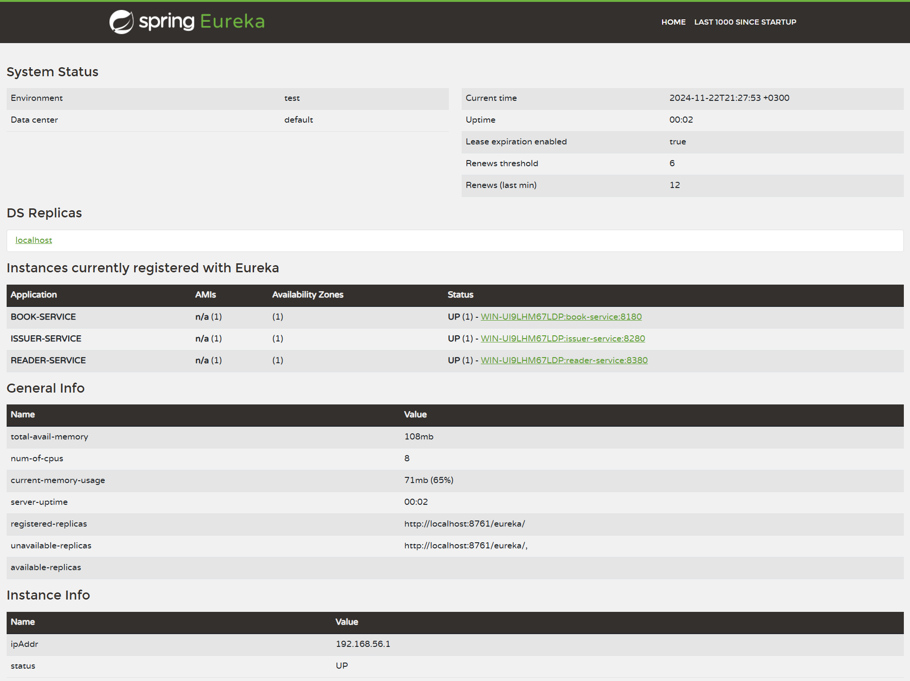

## Веб-сервис для книжной библиотеки с помощью Spring Framework на основе микросервисной архитектуры.

---

### Структура / модули:
1. [Сущности](https://github.com/MikhailAkulov/BookLibrary_Microservices_Spring_Framework/tree/main/model/src/main/java/ru/gb/api) (Книга, Автор, Читатель) 
2. [Книжный сервис](https://github.com/MikhailAkulov/BookLibrary_Microservices_Spring_Framework/tree/main/book-service/src/main/java/ru/gb)
3. [Сервис читателей](https://github.com/MikhailAkulov/BookLibrary_Microservices_Spring_Framework/tree/main/reader-service/src/main/java/ru/gb)
4. Сервис регистрации [выдач](https://github.com/MikhailAkulov/BookLibrary_Microservices_Spring_Framework/tree/main/issuer-service/src/main/java/ru/gb) книг читателям
5. Discovery-service
6. Собственный стартер

---

### Реализованные задачи:
* разработал микросервисы управления коллекциями читателей, книг, выдач книг читателям
* реализовал для них `REST-контроллеры` с использованием реактивного подхода WebFlux
  * [BookController](https://github.com/MikhailAkulov/BookLibrary_Microservices_Spring_Framework/blob/main/book-service/src/main/java/ru/gb/api/BookController.java)
    * получить список всех книг `http://localhost:8180/api/book` [см. скриншот](https://github.com/MikhailAkulov/BookLibrary_Microservices_Spring_Framework/blob/main/image/localhost8180ApiBook.png)
    * получить случайную книгу `http://localhost:8180/api/book/random` [см. скриншот](https://github.com/MikhailAkulov/BookLibrary_Microservices_Spring_Framework/blob/main/image/localhost8180ApiBookRandom.png)
  * [ReaderController](https://github.com/MikhailAkulov/BookLibrary_Microservices_Spring_Framework/blob/main/reader-service/src/main/java/ru/gb/api/ReaderController.java)
    * получить список читателей `http://localhost:8380/api/reader` [см. скриншот](https://github.com/MikhailAkulov/BookLibrary_Microservices_Spring_Framework/blob/main/image/localhost8380ApiReader.png)
  * [IssueController](https://github.com/MikhailAkulov/BookLibrary_Microservices_Spring_Framework/blob/main/issuer-service/src/main/java/ru/gb/api/IssueController.java)
    * получить список всех выдач книг `http://localhost:8280/api/issue` [см. скриншот](https://github.com/MikhailAkulov/BookLibrary_Microservices_Spring_Framework/blob/main/image/localhost8280ApiIissue.png)
    * освежить список всех выдач книг `http://localhost:8280/api/issue/refresh` [см. скриншот](https://github.com/MikhailAkulov/BookLibrary_Microservices_Spring_Framework/blob/main/image/localhost8280ApiIssueRefresh.png)
  * P.S.: 
    * Для удобства и наглядности, заполнение коллекций **Читателей** и **Книг** реализовал с помощью `JavaFaker`, вписав его в конструкторы контроллеров и настроив на создание 15 экземпляров.
    * Лист **Выдач** заполняется посредством ручки `/api/issue/refresh` и одноименного метода, который создает 15 записей. 
  Даты генерируются с помощью `JavaFaker`, а *Книга* и *Читатель* подтягиваются из соответствующих методов 
  [BookProvider](https://github.com/MikhailAkulov/BookLibrary_Microservices_Spring_Framework/blob/main/issuer-service/src/main/java/ru/gb/BookProvider.java) 
  и [ReaderProvider](https://github.com/MikhailAkulov/BookLibrary_Microservices_Spring_Framework/blob/main/issuer-service/src/main/java/ru/gb/ReaderProvider.java)
* установил и настроил службу обнаружения Eureka [discovery-service](https://github.com/MikhailAkulov/BookLibrary_Microservices_Spring_Framework/tree/main/discovery-service/src/main/java/ru/gb)
  
  [скриншот XML](https://github.com/MikhailAkulov/BookLibrary_Microservices_Spring_Framework/blob/main/image/eurekaApps.png)
* создал [стартер](https://github.com/MikhailAkulov/BookLibrary_Microservices_Spring_Framework/tree/main/timer-aspect-starter/src/main/java/ru/gb/timer), инкапсулирующий в себе [аспект-таймер](https://github.com/MikhailAkulov/BookLibrary_Microservices_Spring_Framework/blob/main/timer-aspect-starter/src/main/java/ru/gb/timer/TimerAspect.java), замеряющий время выполнения метода бина, помеченного аннотацией `@Timer` в клиентских микросервисах

---

### Порядок запуска:

1. book-service
2. reader-service
3. discovery-service
4. issuer-service

---

#### Стек: Spring Boot, Spring Web, Spring WebFlux, Spring Eureka, Spring Configuration Processor, Spring AOP, JavaFaker, Lombok, Maven.